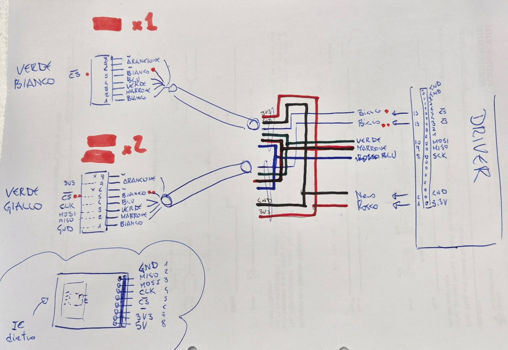

### Getting started with new board.

### wirings

Connect everything according to the following schema 

.


### odrive configuration

The configure the odrive

``` console
    cd exo/config
    python config_odrive.py 
```


### Backup restoring

``` console
    odrivetool backup-config [<output_file.json>]
```

``` console
    odrivetool restore-config <backup.json>
```

